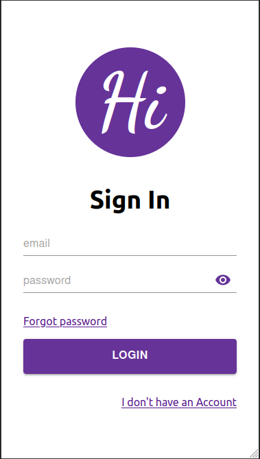
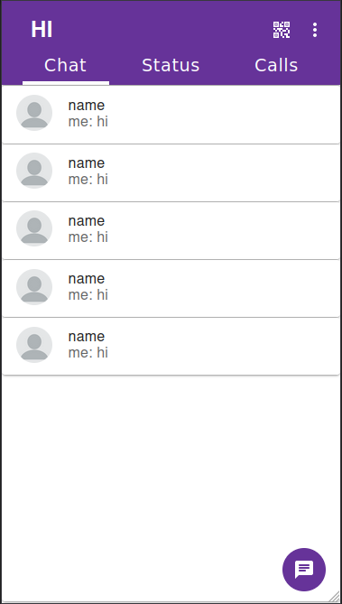

# HI

This is a chat app using react and firebase, It's my side project and also expecting some ideas and your support. Now it's not responsive

### App Features

- [x] login 
- [x] signUp 
- [x] set profile
- [ ] follow and unfollow
- [ ] edit profile
- [ ] change password
- [ ] home
- [ ] about 
- [ ] users info
- [ ] personal chat 
- [ ] group chat
- [ ] block chat
- [ ] report user
- [ ] log out

## images
<div align="center">
    
    &nbsp;&nbsp;&nbsp;&nbsp;&nbsp;&nbsp;&nbsp;&nbsp;
    
    &nbsp;&nbsp;&nbsp;&nbsp;&nbsp;&nbsp;&nbsp;&nbsp;
    
    &nbsp;&nbsp;&nbsp;&nbsp;&nbsp;&nbsp;&nbsp;&nbsp;
    
</div>
<!-- <br /> -->
<!-- <br /> -->
<!-- <div align="center">
    
    &nbsp;&nbsp;&nbsp;&nbsp;&nbsp;&nbsp;&nbsp;&nbsp;
    &nbsp;&nbsp;&nbsp;&nbsp;&nbsp;&nbsp;&nbsp;&nbsp;
    
</div> -->


<br />

## **Test App**

### If you have any idea please share with me   

<br />

```bash
git clone https://github.com/Rahul0070050/HI-Chat.git
```

Go to the directory

```bash
cd HI-Chat
```

```bash
npm start
```
### Thank you!